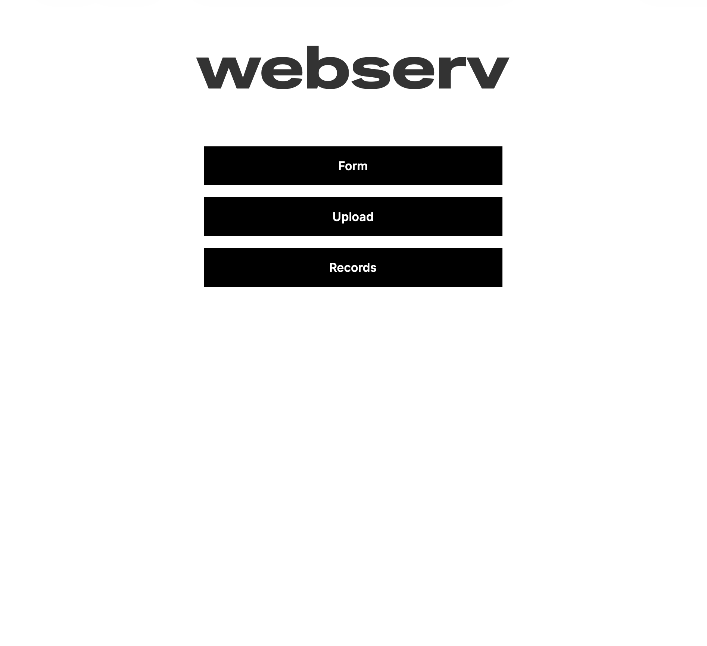
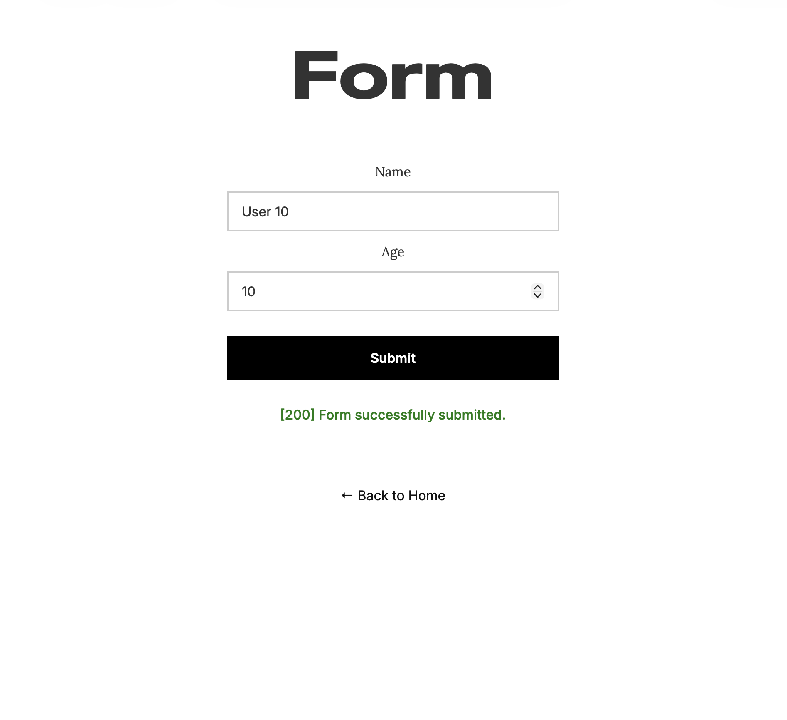
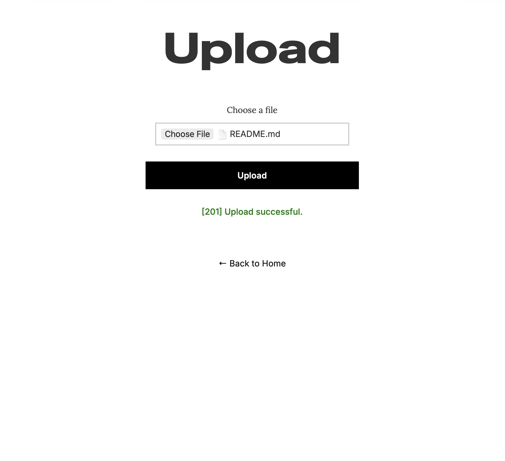
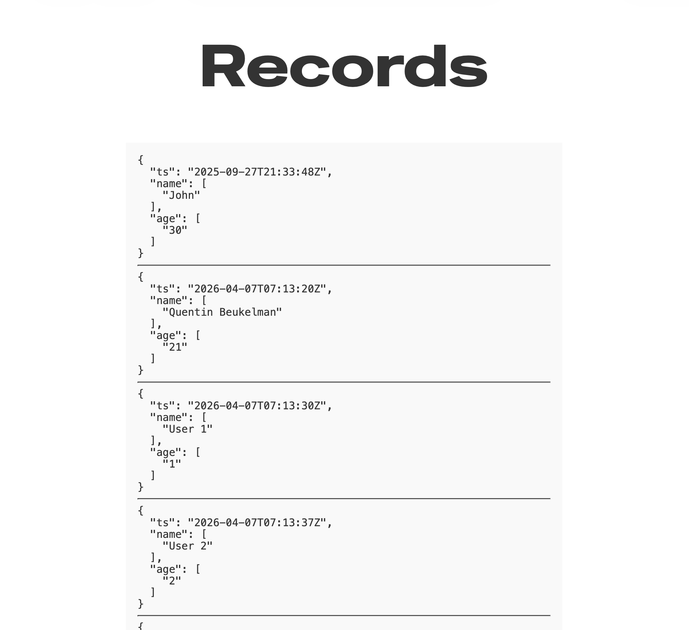

<h1 align="center">
    Web Serve
</h1>

A lightweight HTTP/1.1 web server written in C++, built as part of the 42 curriculum. The project focuses on low-level networking, request parsing, and server configuration handling.

---
<br/>


## Table of Contents

- [Setup](#setup)
- [Features](#features)
- [CGI Data Storage](#cgi-data-storage)
- [Testing](#testing)
  - [Documentation](#documentation)
  - [Test Frontend](#test-frontend)
- [Collaboration](#collaboration)

---
<br/>


# Setup

1. Build the C++ project using `make`.

```bash
# Build
make
```

2. Run the program with a defined configuration. By default, `default` configuration is applied.


```bash
# Run with default config
./webserv

# Specify config
./webserv config/default.conf
```


3. Edit server configuration in config file. See documentation at [configs/README.md](configs/README.md)

4. Use frontend tester to interface with server: http://127.0.0.1:8080/website/pages/index.html
---

<br/>


# Features

The server implements a core subset of HTTP/1.1 functionality, focusing on correctness, configurability, and robustness. It supports dynamic content via CGI, efficient request handling through non-blocking I/O, and a range of HTTP behaviors expected from a modern web server.

- HTTP/1.1 compliant server.
- Non-blocking I/O with `poll`.
- Configurable via .conf file (NGINX-inspired).
- Multiple virtual servers (host + port).
- Static file serving.
- Directory listing (autoindex).
- File uploads (POST).
- File deletion (DELETE).
- CGI execution (e.g. Python scripts).
- Chunked transfer encoding support.
- Custom error pages.
- Redirections (3xx).
- Robust error handling (4xx / 5xx).

---
<br/>


# CGI Data Storage

The `form.py` CGI script implements a persistent data storage system.

- POST requests store submitted form data (name, age) as JSON records.
- Each record is timestamped and appended to a .jsonl file.
- GET requests retrieve stored records:
    - Returns recent entries.
    - Supports query filtering via URL parameters.
- Data is stored in: var/www/data/records.jsonl.

### Examples

```bash
# POST → store data
curl -X POST \
  -H "Content-Type: application/x-www-form-urlencoded" \
  -d "name=John&age=30" \
  http://127.0.0.1:8080/scripts/form.py
```

```bash
# GET → retrieve all records
curl http://127.0.0.1:8080/scripts/form.py
```

```bash
# GET → filtered records
curl "http://127.0.0.1:8080/scripts/form.py?name=John"
```

---
<br/>


# Testing

## Documentation

Find documentation on testing webserv [tests/README.md](tests/README.md).

## Test Frontend

A minimal frontend is included to simplify manual testing and interaction with the server.

- Provides an easy interface for sending requests (GET / POST / DELETE).
- Allows quick testing of file uploads, CGI scripts, and error handling.
- Displays server responses directly in the browser.
- Reduces the need for repetitive curl commands during development.

This frontend serves as a lightweight testing tool to validate server behavior in a more user-friendly way.

<br>

## Table showing frontend tester pages

| Page                                                                | Description                                                                                                                                         |
| ------------------------------------------------------------------- | --------------------------------------------------------------------------------------------------------------------------------------------------- |
|              | **Home page** providing navigation to the different testing tools (Form, Upload, Records). Acts as the entry point for interacting with the server. |
|               | **Form interface** for testing CGI POST requests. Submits `name` and `age` to the CGI script and stores the data server-side.                       |
|           | **File upload interface** for testing multipart/form-data handling. Allows users to upload files and verify server-side storage and responses.      |
|         | **Records viewer** for displaying stored CGI data. Fetches and renders previously submitted records, optionally filtered via query parameters.      |

---
<br/>


# Collaboration

This project was created by _Quentin Beukelman_ and _Hein Smolder_ as part of the 42 Codam program.

---
<br>


